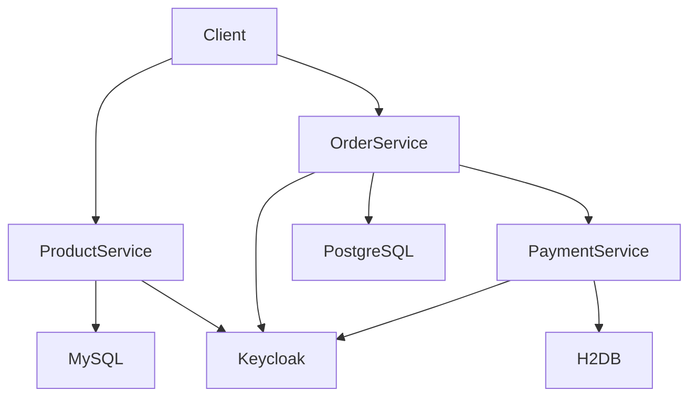
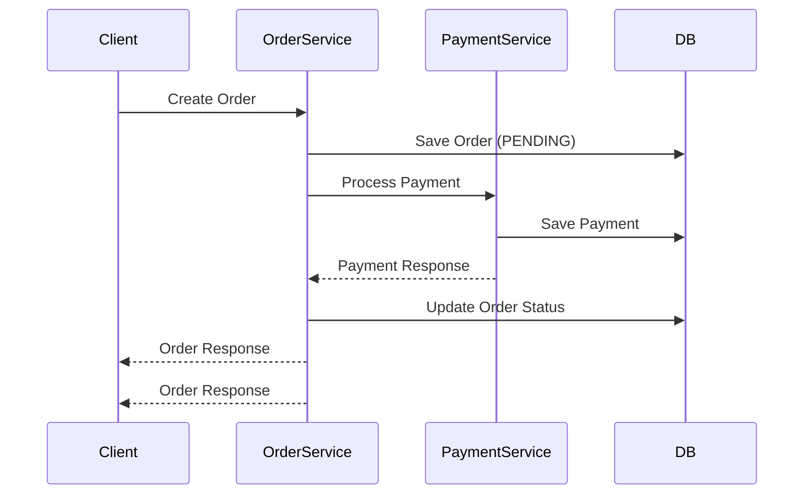

# 🛒 Distributed E-Commerce System

A microservices-based eCommerce backend built using Spring Boot, demonstrating secure service communication, order processing, payment handling, and production-grade observability & CI/CD practices.
---

## 🚀 Features

- Product management (CRUD APIs)
- Order creation and processing
- Payment processing with idempotency protection
- JWT authentication using Keycloak
- Secure inter-service communication using OpenFeign
- Validation and error handling
- Microservices architecture

---

## 🏗️ Architecture

This diagram shows how services interact with each other and their respective databases. All services are secured using JWT issued by Keycloak.

---
## 🔄 Order → Payment Flow

This flow demonstrates how an order is processed and how payment is handled across services.

## 🔐 Security

- Authentication via Keycloak
- JWT-based authorization
- Role-based access control (USER, ADMIN)
- Each service acts as an OAuth2 Resource Server

## 🧠 Idempotency Handling

To prevent duplicate payments:

- Service-level check: findByOrderId(orderId)
- Database constraint: order_id UNIQUE

Ensures:

One Order = One Payment

## 📊 Observability

Implemented full observability stack:

- Prometheus → metrics collection
- Grafana → dashboards (latency, request rate, errors)
- Loki + Promtail → centralized logging
- Jaeger → distributed tracing
- Key capabilities:
- Trace requests across services using traceId
- Debug latency using p95 metrics
- Identify bottlenecks using Jaeger spans
- Correlate logs using orderCode / traceId

## ⚙️ CI/CD Pipeline

Implemented modern CI/CD practices:

- GitHub Actions for CI pipelines
Automated:
    - Build & test (Maven)
    - Docker image creation
    - Security scan (Trivy)
- Image pushed to Docker registry
- Deployment using Docker Compose

## 🚀 Deployment Strategy

- Implemented Blue-Green Deployment:

- Blue = current version
- Green = new version
- Traffic switched only after validation
- Enables:
    - Zero/low downtime
    - Quick rollback

## 🛠️ Tech Stack
- Backend:
Java 17, Spring Boot, Spring Security
- Data:
PostgreSQL, MySQL, H2
- Security:
Keycloak, OAuth2, JWT
- Observability:
Prometheus, Grafana, Loki, Jaeger
- CI/CD:
GitHub Actions, Docker, Trivy
- Communication:
OpenFeign

## 🧪 API Endpoints
- Product Service
- GET /api/products
- POST /api/products
- Order Service
- POST /api/orders
- GET /api/orders/{id}
- Payment Service
- POST /api/payments/process
- GET /api/payments/order/{orderId}
  
## 🧰 Running Locally
- Prerequisites
- Java 17+
- Maven
- Docker (optional)
- Run services
- mvn spring-boot:run
