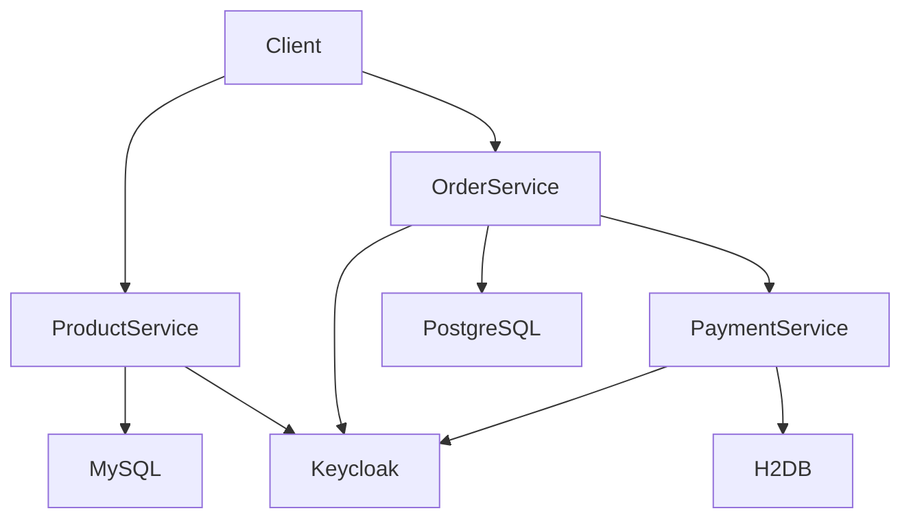
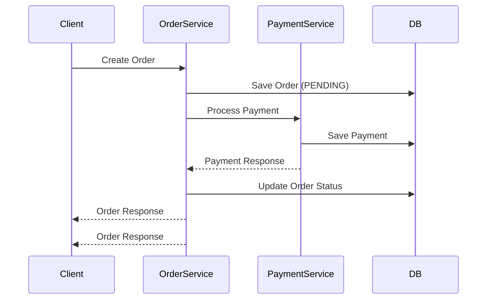

# 🛒 Distributed E-Commerce System

A microservices-based eCommerce backend built using Spring Boot.  
This project demonstrates secure service-to-service communication, order processing, and payment integration using JWT authentication.

---

## 🚀 Features

- Product management (CRUD APIs)
- Order creation and processing
- Payment processing with idempotency protection
- JWT authentication using Keycloak
- Secure inter-service communication using OpenFeign
- Validation and error handling
- Microservices architecture

---

## 🏗️ Architecture

This diagram shows how services interact with each other and their respective databases. All services are secured using JWT issued by Keycloak.

---
## 🔄 Order → Payment Flow

This flow demonstrates how an order is processed and how payment is handled across services.

## 🔐 Security

- Authentication via Keycloak
- JWT-based authorization
- Role-based access control (USER, ADMIN)
- Each service acts as an OAuth2 Resource Server

## 🧠 Idempotency Handling

To prevent duplicate payments:

- Service-level check: findByOrderId(orderId)
- Database constraint: order_id UNIQUE

Ensures:

One Order = One Payment

## 🛠️ Tech Stack
- Java 17+
- Spring Boot
- Spring Security (OAuth2 Resource Server)
- Spring Data JPA
- OpenFeign
- Keycloak
- MySQL, PostgreSQL, H2
- Maven

## 🧪 API Endpoints
- Product Service
- GET /api/products
- POST /api/products
- Order Service
- POST /api/orders
- GET /api/orders/{id}
- Payment Service
- POST /api/payments/process
- GET /api/payments/order/{orderId}
  
## 🧰 Running Locally
- Prerequisites
- Java 17+
- Maven
- Docker (optional)
- Run services
- mvn spring-boot:run

## Run each service separately.
📌 Future Improvements
- API Gateway (Spring Cloud Gateway)
- Service Discovery (Eureka)
- Inventory/Stock Service
- Event-driven architecture (Kafka)
- Docker & Kubernetes deployment
- CI/CD pipeline (GitHub Actions)
  
